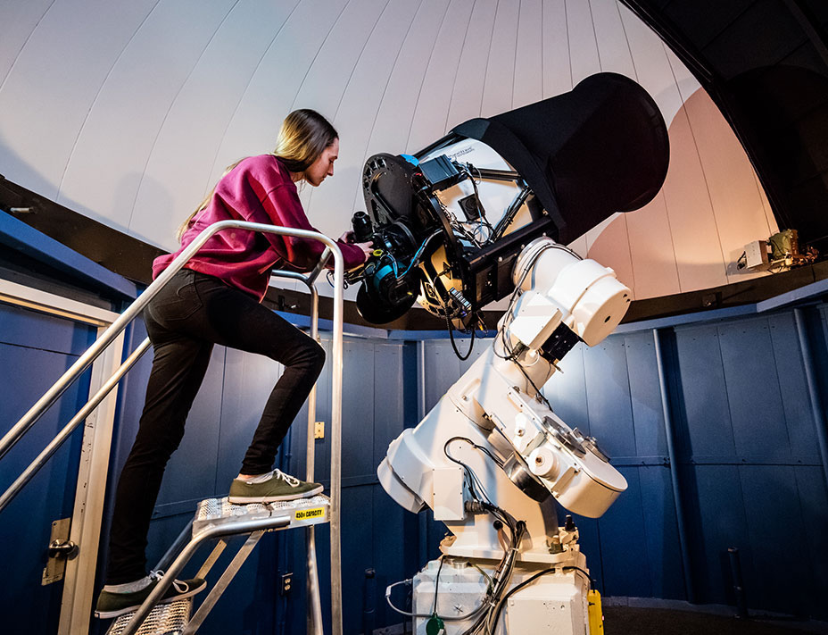

I help <em>a lot</em> of people enjoy the sky.

I'm Tiffany, excited about sharing the world of astronomy or math or science with you.

**I'm the Astronomy Technician for the Astronomy & Physics department, including the [Burke-Gaffney Observatory](https://observatory.smu.ca) at Saint Mary's University in Halifax, NS.**
I love to look at the sky (and will gasp and exclaim "look at the moon!" whenever I notice it) and want to help you do the same.

Here's some of the other neat positions I've held in the past:
* Virtual Planetarium Show Presenter at [Astronomy in Action](https://www.astronomyinaction.com/)
* Physics Lab Instructor at Saint Mary's University
* Online Astronomy Instructor at Washtenaw Community College
* Educational Assistant at [WISEatlantic](http://wiseatlantic.ca/)
* Planetarium Show Host at the [Discovery Centre](https://thediscoverycentre.ca/)

I'm into helping others understand things, understanding things, and making things work. I also have three dogs, all with space-adjacent names (Ripley, Kepler, and Nimbus).

Find some blog posts and other information along the top menu, or not, because this website is always a work-in-progress.

<h3>
Contact:</h3>

tiffany [dot] fields [at] smu.ca

Or find me on <a href="links.html">any social media platform</a> you can think of.

			

