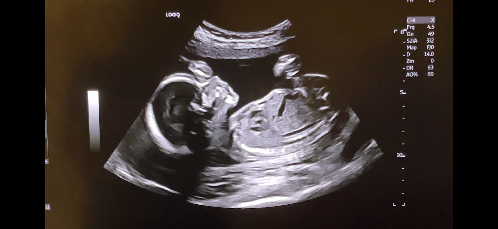

# 🚀 Saturday August 22, 2026. Illinois; USA

## What

**Celebrate upcoming Baby Boy with Tiffany & Blair!** This is a ***co-ed*** event, everyone is invited to our Baby Shower to give us an opportunity to spend time with friends and family and help prep for all of Baby's needs!

## When 

Saturday August 22nd, starting at **1pm**

## Where

Location details

## Who

You!! And Tiffany & Blair and friends and family!

## "Diaper" Raffle

Though diapers and wipes are an extremely useful baby shower gift... We'd have a hard time taking big diaper boxes back on the plane! There is a ***DAIPER RAFFLE*** set-up so you can contribute what you might have spend on a box of diapers or wipes. 
* Cash, Check, PayPal, Venmo, or Cash App is great!
  * PayPal: tiffzny [at] gmail [dot] com
  * Venmo: @Ashlee-Boelens (last 4 digits = 7010)
  * Cash App: @AshleeBoelens
 
## RSVP ?

No need????

 

Honestly, we're just thrilled that you're willing to spend part of the day with us; we're excited to see all the family before the little one arrives (and before I'm too big to travel!).
*We hope you'll come celebrate with us!*

If you're wanting to contribute to Baby Boy's supplies (and our sanity), see the Gifts / Registries links below. (And, thank you so much in advance!)

# 🔭 Gift Ideas / Registries:

* One could contribute **cash** to assist with some of our largest purchases (car seat, stroller) or to help us stock-up on diapers and wipes, perhaps in addition to your **favourite second-hand or pre-loved baby-suitable book?**
  * Digital "cash" accepted by Tiffany via PayPal (tiffzny [at] gmail [dot] com) or via Venmo / Cashapp to Tiffany's cousin Ashlee @[usernames] who will share it at the Aug 22 shower.

* [Amazon USA Baby Registry List](https://www.amazon.com/baby-reg/tiffany-fields-november-2026-moline/23TWGBA0YDPJL)
  → Do you intend to ship items to the **United States**? Use Amazon USA (Amazon.com); this Amazon.com list will ship to Tiffany's mom's house in Illinois by default (you don't need to put in her address!) or can be shipped to a custom address (like your own).

* [Amazon Canada Baby Registry List](https://www.amazon.ca/baby-reg/tiffany-fields-november-2026-dartmouth/IG8SSVX2ZG4O)
  → Do you intend to ship items to **Canada**? Use Amazon Canada (Amazon.ca); this Amazon Canada list will ship to Tiffany & Blair's home in Nova Scotia by default (you don't need to put in our address!). 
  → If for some reason you need a Canadian postal code to see what is available on Amazon.ca, use B3H3C3 (this isn't OUR postal code, but it is nearby and good enough for just browsing! Our actual address will populate from the registry)

* We are *very* into good-condition **second-hand or pre-loved items** for Baby. Do you have a favourite pre-loved book you want to share? Pre-loved outfits or other baby items that are still in good condition? These things would make excellent gifts. (New Baby clothes or items fine too!) :)

# 👨‍🚀 Baby info: 

**Baby boy** is due in mid-November. 

Clothing planning tips:
* 0-3 months: Nov - Feb
* 3-6 months: Feb - May
* 6-9 months: May - Aug
* 9-12 months: Aug - Nov

## Frequently Asked Questions:

### Do I have to dress up??

This was my first question too. 🙏 Wear what you'd like, knowing that Tiffany and Blair will likely want to get a photo with you! :)

### Can I Venmo you so you can get diapers or whatever else you need? 

You can Venmo or Cash App Tiffany's cousin Ashlee! She'll be sure it gets to us (usernames @ top of page). 

We Canadians do not have Venmo or Cashapp. Tiffany has PayPal to accept digital US dollars, email: tiffzny [at] gmail [dot] com. 

(For Canadians: e-transfers to the same email address are excellent! I do not have auto-deposit turned on so leave me an easy password please.)

### Can I ship things directly to you?

In the US, bring them to the shower with you on Aug 22! Or, you can drop-off or ship to Tiffany's Mom's home (Moline, IL).

To Canada, you can ship directly to our home (Dartmouth, NS). 

In order to not publish our addresses on the public internet... reach out to Tiffany or Blair, Tiffany's Dad (Jason) or Mom (Kris), or Tiffany's cousin Ashlee via various means to get specific addresses if you need! ❤️

### It looks like you're missing some items on your registry... What do you already have?

We are grateful to have collected a number of previously-loved items from friends, colleagues, and neighbours. We already have a crib, bassinet, a "pack-and-play," and an assortment of pre-loved clothes. But, you're right. I'm probably missing other items! I'm doing this for the first time, ok?!

### But how are you going to get this all home on an airplane????

Valid concern. The hope is we'll receive items that will fit into checked bags! We have *plenty* of luggage space to bring home on the plane; but checked bags have size limits! If you're interested in helping us with something larger than will typically fit in a checked bag (like a carseat or stroller), we'd be grateful, AND reach out to Tiffany's mom (Kris) or cousin Ashlee, or to Tiffany.

### What are you gonna name him?

We have no idea yet! Are you aware we have three dogs? The third puppy was without a name for nearly a week after we brought him home...

